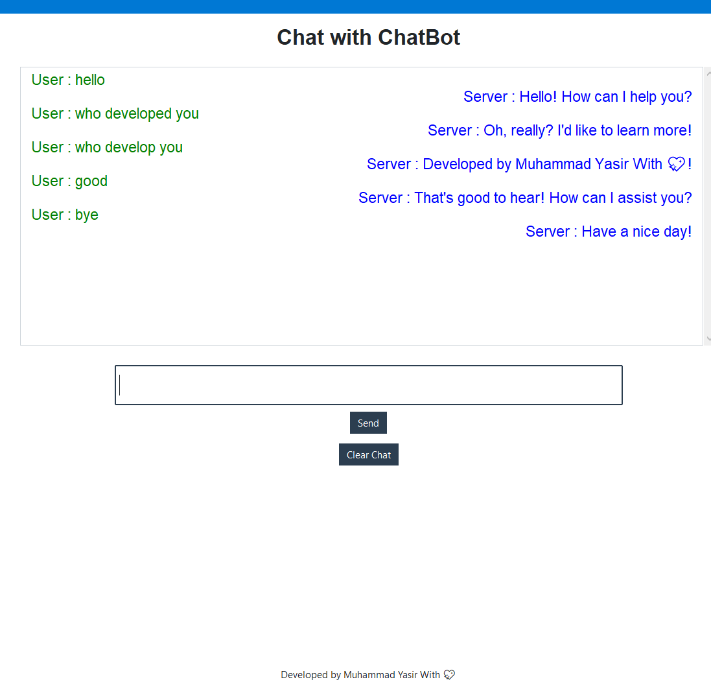

🧠 LAN ChatBot – CodeAlpha Internship Task
📌 Project Title:
LAN ChatBot – Real-Time Communication Over Local Network

👨‍💻 Internship Program:
CodeAlpha – Python Programming Internship

📝 Task Type:
Intermediate-Level Project – Real-Time LAN-Based ChatBot

📂 Project Description
This LAN ChatBot is a real-time messaging application developed using Python socket programming. It allows  users connected over the same Local Area Network (LAN) to chat with each other via a server-client architecture. The project was developed as part of a task assigned by CodeAlpha Internship Program to enhance practical understanding of networking and concurrent programming.

## 🖼️ Screenshot

🧰 Tech Stack
Language: Python 3.x

Modules Used:

socket – For network communication

threading – To handle multiple clients concurrently

tkinter and ttkbootstrap – For GUI interface 

🎯 Features
✅ Peer-to-peer chat via server
✅  handling using threads
✅ Real-time communication on LAN
✅ Easy-to-use command-line or GUI (optional)
✅ Chat timestamps with usernames
✅ Clean and beginner-friendly code structure

📌 Learning Outcomes
Through this project, I enhanced my knowledge in:

Python’s socket and threading modules

Building real-time communication systems

Working with client-server models

Structuring Python projects cleanly

👨‍💼 Developed By
Muhammad Yasir 
Intern at CodeAlpha – Python Programming Track

📃 License
This project is open-source and free to use under the MIT License.
